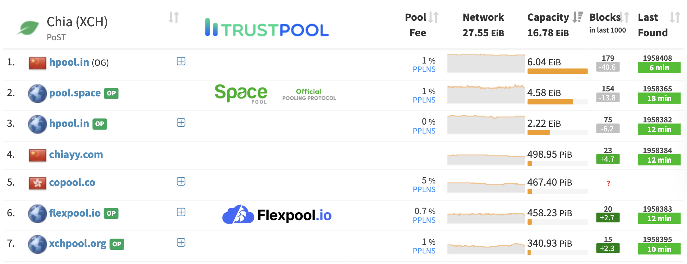

<link rel="stylesheet" href="assets/css/custom.css">

## Roles I'm searching for...

### Web3 Engineer
I'm most interested in a role that allows me to build the future of **blockchain** and **web3**. I believe the decentralization of software is core to our future and essential for thriving in the tech industry. Whether this is smart contract development or general software engineering for a cryptocurrency/blockchain company, count me in.

### Web Developer
The secondary role I am looking for is a web developer. This is what I have the most experience in and believe I have a good understanding of the full stack. From databases and backends to presenting things on a webpage, I can do it.

### Devrel (Developer Relations)
Need an engineer who can also build a community? I'm well versed in simplifying technical content and helping people succeed in an ecosystem. I'm familiar with markdown documentation, video tutorials, Discord management,and software development.

## I'm Currently Working on...

### YouTube
My bread and butter has been YouTube. Although I absolutely love YouTube and have no plans of quitting, I want it to be a passion project and hobby again. I want to build more real-world experience so I can provide more value to viewers. Currently sitting at over 500K+ total subscribers across two channels, I've helped teach a lot of people a lot of stuff. 

I focus on cryptocurrency and software development training (this includes languages like C++, JavaScript, SQL, and more).

<iframe width="560" height="315" src="https://www.youtube.com/embed/ALdtGsyTh2E" title="YouTube video player" frameborder="0" allow="accelerometer; autoplay; clipboard-write; encrypted-media; gyroscope; picture-in-picture" allowfullscreen></iframe>
 
<iframe width="560" height="315" src="https://www.youtube.com/embed/CW3h9FS2-SA" title="YouTube video player" frameborder="0" allow="accelerometer; autoplay; clipboard-write; encrypted-media; gyroscope; picture-in-picture" allowfullscreen></iframe>

### Space Pool

Today I am the cofounder of [Space Pool](http://pool.space), a Chia farming (mining) pool with over 30K members. The Space Pool Discord is the go-to community for any talk about the Chia cryptocurrency with 35K+ members. I am a full stack web developer using a variety of languages and tools like **React**, **Node.js**, **typescript**, and **ASP.NET**. I also created a crypto price **discord bot written in Python**. 

Space Pool is the largest Chia pool using the official pooling protocol, and the second largest overall. 
 
[source](https://miningpoolstats.stream/chia) 

## My Skills Include...

### Solidity

I'm comfortable with the **Solidity** language and continue to improve my skills. I've deployed sample contracts on the Kovan Ethereum testnet. [You can find the code here](https://github.com/CalebCurry/initial-solidity) and links to the smart contracts in the `readme.md`. This code includes multiple projects. One will use a [**Chainlink Oracle**](https://github.com/CalebCurry/initial-solidity/blob/main/docs.chain.link/samples/Tutorials/PriceChecker.sol) to get the current Ethereum price, another is a [lottery system](https://github.com/CalebCurry/initial-solidity/blob/main/projects/lottery.sol) that gives multiple contributors the chance to win some Eth!

I have also created ERC20 tokens with OpenZeppelin. 

### NFTs

Starting with the basics, I have bought and sold NFTs on OpenSea.io and am familiar with **metamask** and the various networks (Ethereum, Polygon, Solana). I am currently learning the [HashLips art engine](https://github.com/HashLips/hashlips_art_engine) used to generate NFT collections and working on my own NFTs. Coming soon!

One interest of mine is NFTs with utility. For example, I own multiple domains that are NFTs. This allows me to fully own the domain and host decentralized websites on **IPFS**. I believe much more in life could be tokenized and decentralized. 

### Web Development

I have experience in most major backend languages and frameworks including **Node.js**, **ASP.NET**, **Django**, and **Flask**. For frontend, I know **React**, **Typescript**, and the essentials of **CSS**.  

I have a good understanding of Databases (**SQL** and **NoSQL**) and I'm comfortable building an **API** using **JWT authorization**. I can create login systems in **React** and deploy everything to production on **AWS**.  

I am able to build software in a team environment with **GitHub**, branches, and pull requests. This includes open source software such as [this portfolio website](https://github.com/CalebCurry/site) built with **Jeckyll** and hosted on **GitHub Pages**. Additionally, I have a good understanding of **Markdown** and technical documentation engines such as **Docusaurus** and **GitBook**. You can find an example of a [documentation website](https://wiki.pool.space/) I built. Here is the [open source code](https://github.com/space-pool/wiki).  